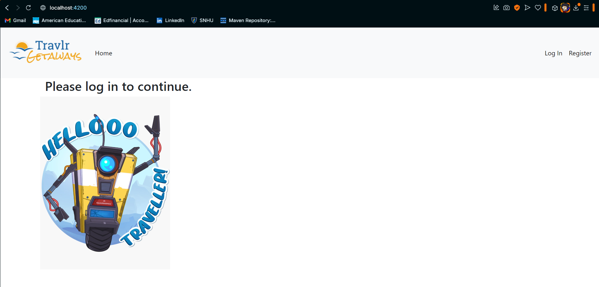
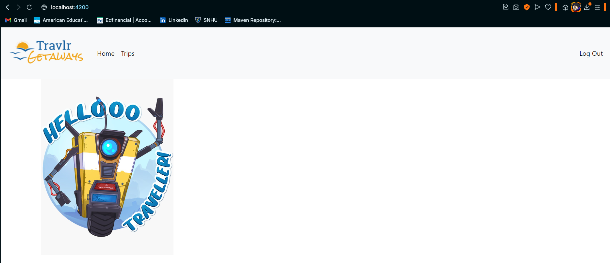
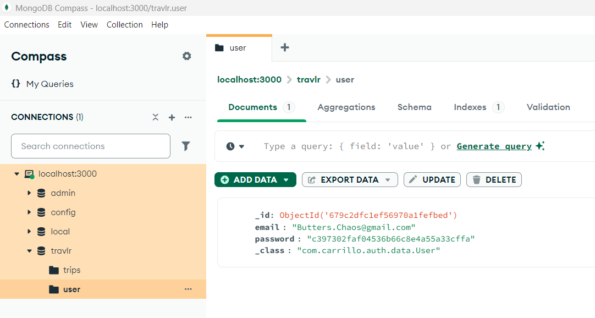
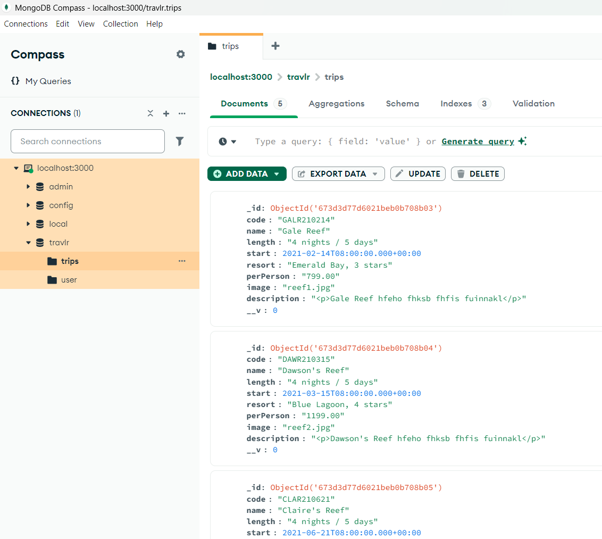

## Final Eportfolio presented for CS-499 Computer Science Capstone at SNHU

### Professional Self-Assessment

The time I have spent towards my Computer Science degree at Southern New Hampshire University (SNHU) has positively altered my professional goals and values. I have been preparing to become a beneficial addition to a team for an employer to consider. This portfolio serves to show off my abilities in the field, such as planning, organization, and problem solving. This will be described further along with each project description below.

Throughout this course, and several previous ones, I have gained knowledge in several categories. These include understanding how communication with team members and stakeholders are typically conducted, how to make working with other team members easier to manage, and What each team member is responsible for in terms of the project. All this helps improve the Software Development Lifecycle, and produce stable and secure code.

### Code Review

A code review is an opening introduction to the current functionality of a project and what the plans are to enhance that project. This is a very integral step to the beginning of a projects work cycle, as it ensures consistency in the development process and the following of best practice standards. Although there were some pieces of information I had missed going over in this particular example, I have learned from it and strongly believe to have improved from it.

Link to my [Code Review](https://youtu.be/w-tnkFqq3z8)

#### All three projects were performed on the same application, that being the Fullstack 'travlr' travel package service that I had created in CS-465

##### It should be noted that due to file size issues relating to github limitations, and how migrating files to this repository can get collectively confusing for anyone else trying to work with the files in the future, they are seperated into their own repositories and are linked below:

### Project 1: Software Engineering and Design

The first artifact was focused on transitioning the API from Javascript to Java, with the intention of simplifying and improving its functionality. It created a more organized structure for easier usability. Pictured below is what it looks like before and after the user has logged in or registered. Here is the corresponding [narrative](CS499Milestone2Narrative.docx)

### Project 2: Algorithms and Data Structures

The second artifact was focused on using algorithms to hash the password and email that the user enters for secure storage in the database when they first register and each time they login. The email is encoded once while data is being transferred and decoded, while the password is encrypted and then encoded. it is encoded the same as the email using base64, while the encryption is a permanent MD5 hash that allows the password the user entered to been inserted into the database but not be legible. Here is the corresponding [narrative](CS499Milestone3Narrative.docx)

### Project 3: Databases

Speaking of the database, this artifact is where the iformation for the user logging in or registering is handled, making sure that the database is able to properly return information back to the website. It also contains the trip information to be displayed to the user. Pictured below is what the user and trips information looks like with help from the MongoDB Compass application. Here is the corresponding [narrative](CS499Milestone4Narrative.docx)

Link to the [API](https://github.com/MathiasGitSumNum/AuthenticationAPI) files on Github

Link to the [Main Project](https://github.com/MathiasGitSumNum/cs465-fullstack) files on git hub  
Original files are on the branch titled "module7"  
New version of the program is on the branch titled "NewLogandReg"

I have also included images of my gitbash commands in this repository in order to assist with the execution of the program after setup, should you be interested.

